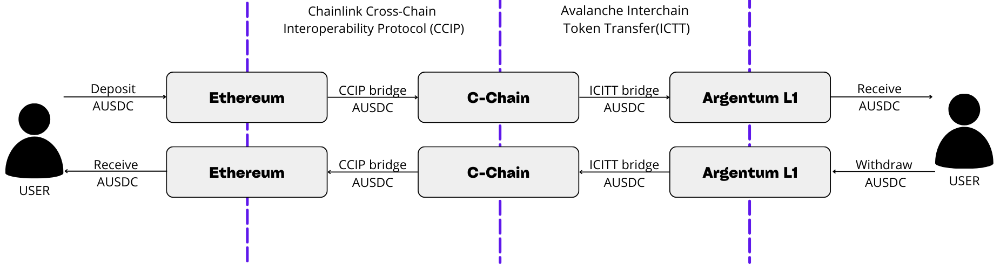

# Argentum Bridge

Our bridge contract uses Chainlink Cross-Chain Interoperability Protocol (CCIP) technology to transfer Aave USDC(AUSDC) from ethereum to the C-chain.

The user deposits AUSDC into our ArgentumSender contract, it locks these funds and sends the `mint(address,uint256)` message to the ArgentumBroker contract on the C-Chain using CCIP.

The `mint` function of the ArgentumBroker contract adds collateral and sends tokens to the Argentum L1 that are to be used as Native using the Avalanche Interchain Token Transfer(ICTT).

The user at any time can return his assets to ethereum using our reverse wing bridge, and the ethereum contract returns his AUSDCs to him.

The interesting thing about this is that the AUSDCs have an earned interest within AAVE so the user will generate a return for staking his tokens in our network and this generates an incentive to generate liquidity in our network.
